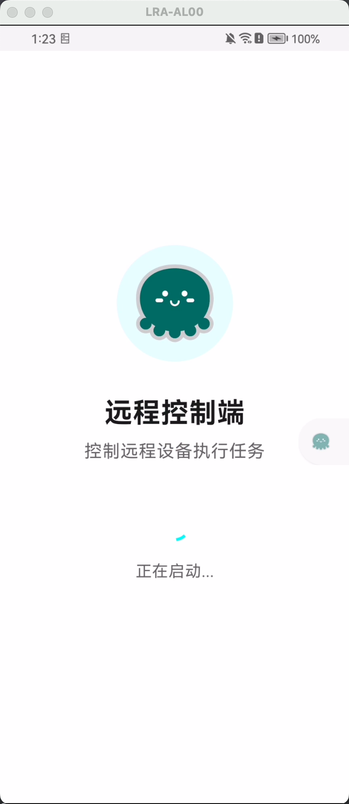
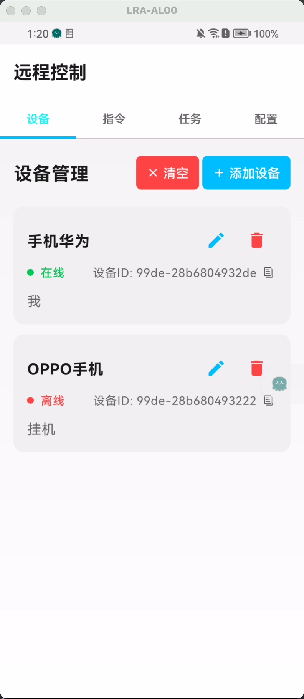
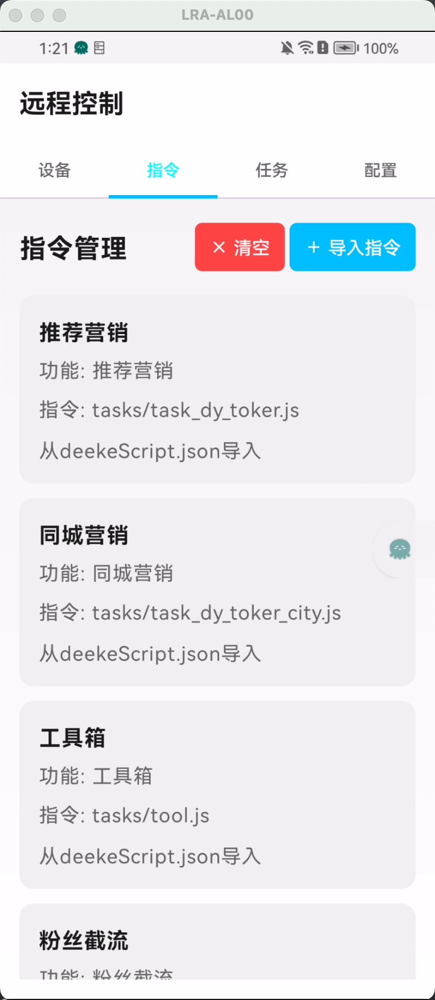
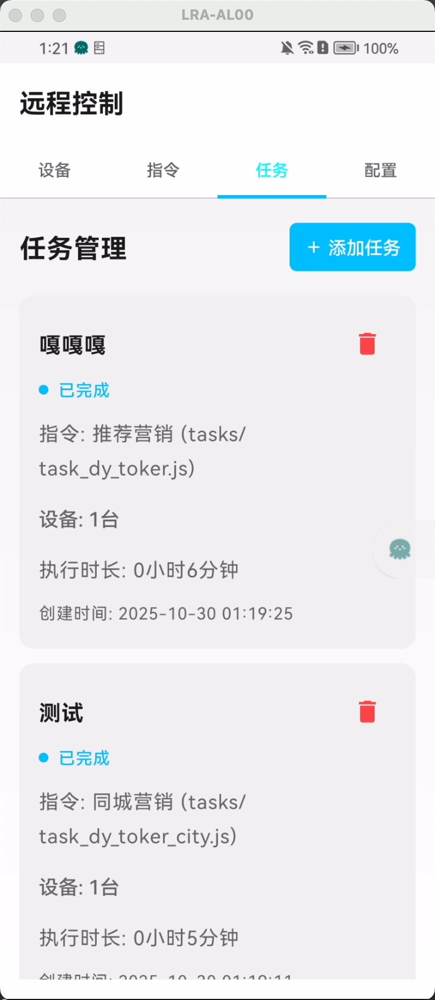
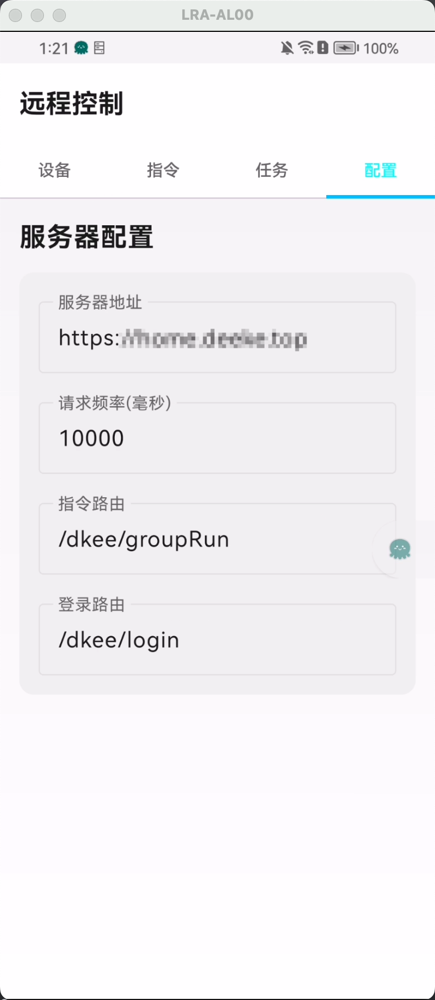

### Deeke远程控制端

Deeke远程控制端，可以通过本控制端APP发送指令给Deeke软件（或者其他DeekeScript开发的APP）。你可以把本APP看做是一个群控的控制端，通过后端接口来控制其他Android端的Deeke应用APP（或者DeekeScript开发的APP）

> [DeekeScript开发文档](https://doc.deeke.cn)

> [Deeke项目演示](https://github.com/deekeScript/ad-deeke)

#### APP截图如下：

    
    
    
    
    

